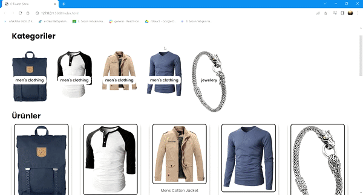

<h1> E-COMMERCE WEB SITE </h1>

I've designed a new project, an online shopping website, where I utilized HTML, CSS, and JS codes. I fetched data using an API and added features such as creating a shopping cart, calculating the total price in the cart, and removing items from the cart. Thank you!

<h1> Used Tecnologies </h1>
HTML5, CSS3, JavaScript 

<h1> SCREENSHOT </h1>

